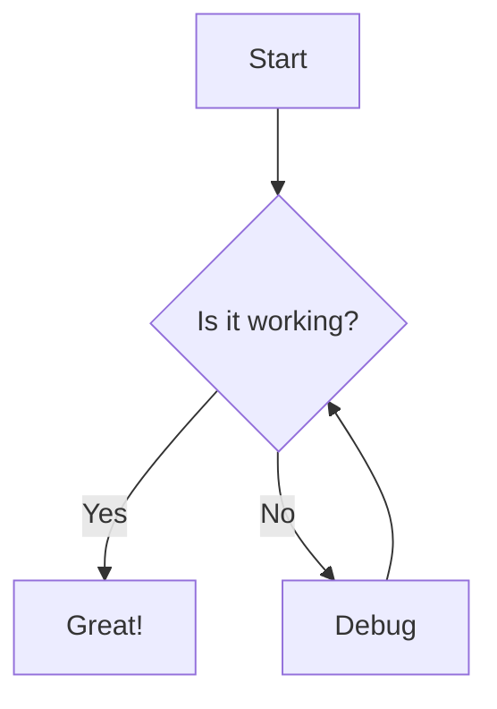
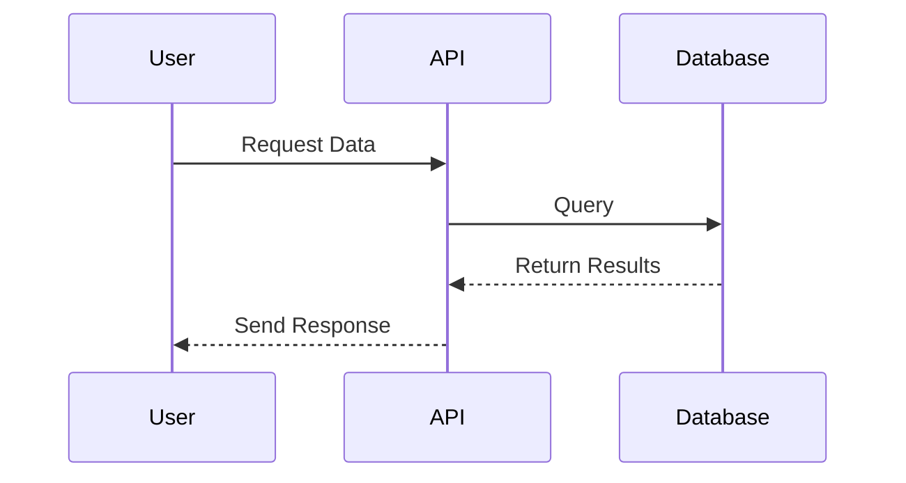
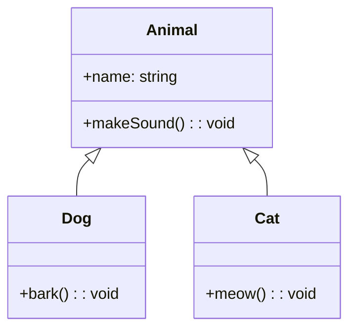
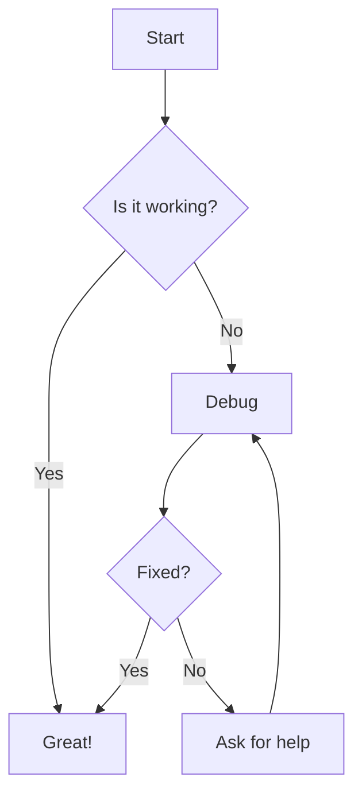
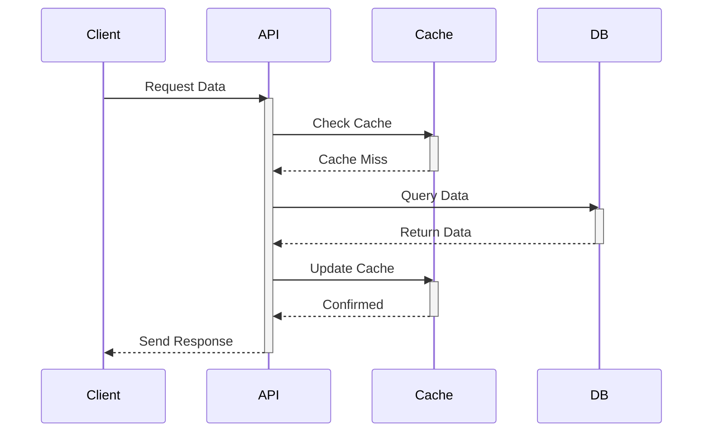
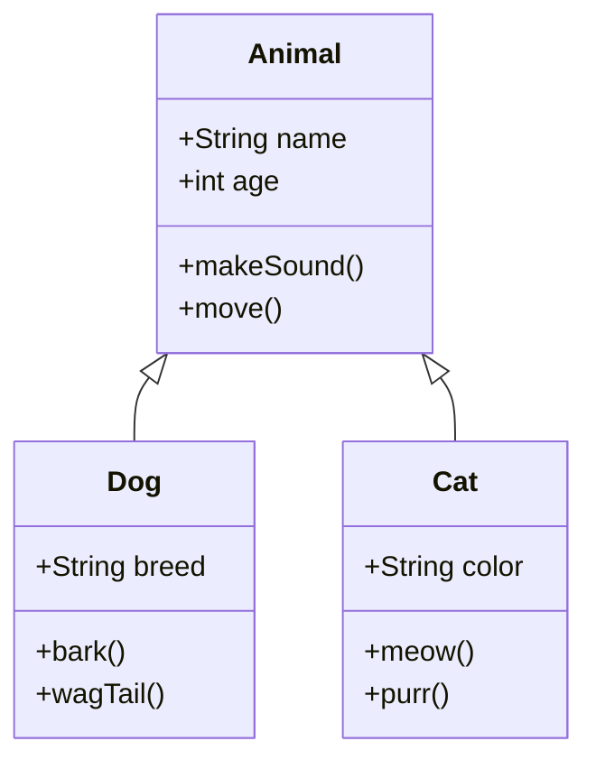
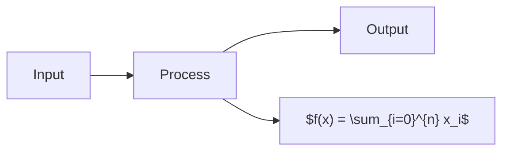
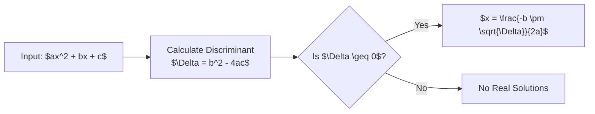

# How to Use Images, Diagrams, and Math in Blog Posts

## Local Images
You can use local images stored in your public directory:

## External Images
You can also use images from trusted external sources:

### From Unsplash

### From GitHub

### From Cloudinary

## Mermaid Diagrams

You can create flowcharts, sequence diagrams, and more using Mermaid:

### Flowchart Example

### Sequence Diagram

### Class Diagram

### Advanced Flowchart

### Advanced Sequence Diagram

### Advanced Class Diagram

## Mathematical Equations

You can write both inline math like $E = mc^2$ and display math:

$$
\frac{d}{dx}\left( \int_{0}^{x} f(u)\,du\right)=f(x)
$$

Here's Maxwell's equations:

$$
\begin{aligned}
\nabla \times \mathbf{E} &= -\frac{\partial \mathbf{B}}{\partial t} \\
\nabla \times \mathbf{H} &= \mathbf{J} + \frac{\partial \mathbf{D}}{\partial t} \\
\nabla \cdot \mathbf{D} &= \rho \\
\nabla \cdot \mathbf{B} &= 0
\end{aligned}
$$

And a matrix:

$$
\begin{bmatrix}
1 & 0 & 0 \\
0 & 1 & 0 \\
0 & 0 & 1
\end{bmatrix}
$$

### Basic Math

Inline equations like $y = mx + b$ or $E = mc^2$ are written between single dollar signs.

Display equations use double dollar signs:

$$
f(x) = \int_{-\infty}^\infty \hat{f}(\xi) e^{2 \pi i \xi x} d\xi
$$

### Complex Mathematics

The Schrödinger equation:

$$
i\hbar\frac{\partial}{\partial t}\Psi(\mathbf{r},t) = \hat{H}\Psi(\mathbf{r},t)
$$

A complex matrix equation:

$$
\begin{bmatrix}
a_{11} & a_{12} & a_{13} \\
a_{21} & a_{22} & a_{23} \\
a_{31} & a_{32} & a_{33}
\end{bmatrix}
\begin{bmatrix}
x_1 \\
x_2 \\
x_3
\end{bmatrix} =
\begin{bmatrix}
b_1 \\
b_2 \\
b_3
\end{bmatrix}
$$

Maxwell's equations in differential form:

$$
\begin{aligned}
\nabla \cdot \mathbf{E} &= \frac{\rho}{\varepsilon_0} \\
\nabla \cdot \mathbf{B} &= 0 \\
\nabla \times \mathbf{E} &= -\frac{\partial \mathbf{B}}{\partial t} \\
\nabla \times \mathbf{B} &= \mu_0\left(\mathbf{J} + \varepsilon_0\frac{\partial \mathbf{E}}{\partial t}\right)
\end{aligned}
$$

### Statistical Formulas

The normal distribution probability density function:

$$
f(x) = \frac{1}{\sigma\sqrt{2\pi}} e^{-\frac{(x-\mu)^2}{2\sigma^2}}
$$

## Combining Features

You can even explain algorithms with both diagrams and equations:

## Combining Math and Diagrams

Here's a flowchart explaining the quadratic formula:

## Best Practices

1. **For Local Images:**
   - Store in `/public/images/blog/`
   - Use relative paths starting with `/images/blog/`
   - Optimize before uploading

2. **For External Images:**
   - Only use trusted sources (configured in next.config.mjs)
   - Specify dimensions when possible
   - Use auto-formatting URLs (like Unsplash's auto=format)

3. **For Mermaid Diagrams:**
   - Keep diagrams simple and focused
   - Use consistent styling
   - Add comments for complex parts

4. **For Mathematical Equations:**
   - Use inline math ($...$) for simple expressions
   - Use display math ($$...$$) for complex equations
   - Break complex equations into multiple lines
   - Add explanatory text around equations

5. **Performance Tips:**
   - Use WebP format when possible
   - Set `priority={true}` for above-the-fold images
   - Specify width and height to prevent layout shift
   - Use responsive images for different screen sizes

> Note: Make sure external domains are added to the `remotePatterns` in next.config.mjs!

## Using HTML for More Control
For more control over your images, use HTML with Next.js Image component:

<Image 
  src="https://images.unsplash.com/photo-1682687220742-aba13b6e50ba"
  alt="Controlled image example"
  width={800}
  height={400}
  className="rounded-lg shadow-md my-4 mx-auto"
  priority={true}
/>
